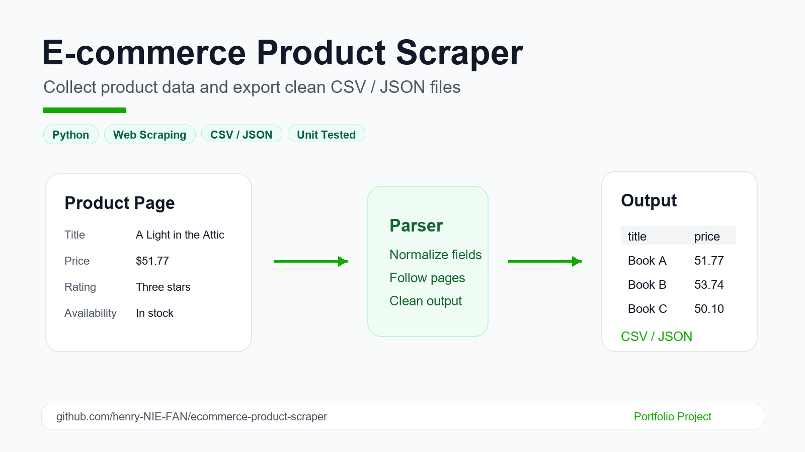

# E-commerce Product Scraper

A portfolio-ready Python scraper that collects product data from a demo e-commerce catalog and exports clean CSV or JSON files.



The project is designed to show practical client-facing skills:

- Web scraping with polite request settings
- Product data extraction
- Pagination support
- CSV and JSON export
- Testable parsing logic

## Demo Target

This project uses [Books to Scrape](https://books.toscrape.com/), a public website made specifically for practicing web scraping.

It collects:

- Product title
- Price
- Rating
- Availability
- Product page URL
- Source page URL

## Project Structure

```text
ecommerce-product-scraper/
  data/
    sample_products.csv
    sample_products.json
  src/
    ecommerce_scraper/
      __init__.py
      cli.py
      exporter.py
      parser.py
      scraper.py
  tests/
    fixtures/
      books_page.html
    test_parser.py
  .gitignore
  README.md
  requirements.txt
```

## Quick Start

This project uses only the Python standard library. Install it locally so the command line tool is available:

```bash
python -m pip install -e .
```

Run the scraper:

```bash
ecommerce-scraper --pages 2 --format csv --output data/products.csv
```

Run the offline demo with the included sample HTML:

```bash
ecommerce-scraper --html-file tests/fixtures/books_page.html --format csv --output data/products.csv
```

Export JSON instead:

```bash
ecommerce-scraper --pages 2 --format json --output data/products.json
```

Run tests:

```bash
python -m unittest discover -s tests
```

## Example Output

| title | price | rating | availability |
| --- | ---: | --- | --- |
| A Light in the Attic | 51.77 | Three | In stock |
| Tipping the Velvet | 53.74 | One | In stock |
| Soumission | 50.10 | One | In stock |

## Why This Project Matters

Clients often need product research, competitor monitoring, catalog extraction, and clean spreadsheet-ready data. This project demonstrates the core workflow behind those tasks:

1. Visit product listing pages
2. Extract useful product fields
3. Normalize messy web data
4. Save results in a client-friendly format

## Client-Ready Features

- Clean command-line interface
- CSV and JSON export for spreadsheet or API workflows
- Pagination support for multi-page catalogs
- Offline demo mode for reliable review
- Unit-tested parsing logic

## Example Client Requests This Solves

- "Scrape product names and prices into a CSV file"
- "Collect competitor catalog data for market research"
- "Extract ratings and availability from product listing pages"
- "Turn website product data into a clean spreadsheet"
- "Build a small scraper I can run again later"

## Notes

This scraper is intentionally configured for a public practice website. For real client work, always review the target site's terms, robots rules, rate limits, and data permissions before scraping.
